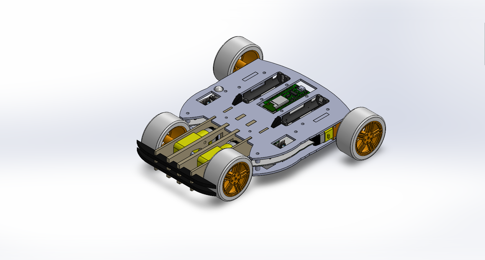
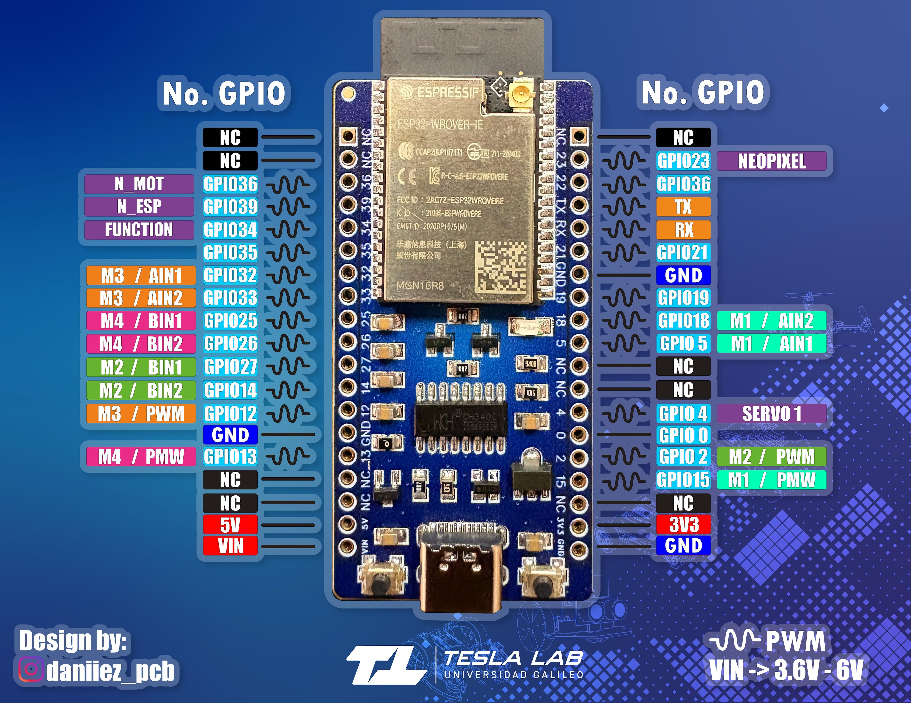

# Proyecto Balam - Categoría Todoterreno


## Descripción

Este repositorio contiene el código base y la documentación necesaria para participar en Proyecto Balam de la categoría **Todo Terreno**. Cada participante recibe un kit que incluye:

* **Shield** diseñada por nuestro equipo.
* **ESP32** diseñada por nuestro equipo.
* Módulo de control de motores TB6612FNG diseñado por nuestro equipo.
* Piezas de acrílico
* Tornillos
* Motores DC (amarillo)
* Baterías
* Llantas

A continuación encontrarás información sobre el pinout, la instalación, ejemplos de uso y recomendaciones.

---

## Estructura del Repositorio
El repositorio se divide en las siguientes secciones:

```plaintext
├── assets/
│   └── images/                  # Diagramas y recursos gráficos
├── examples/                    # Ejemplos de uso simplificados
│   ├── motor_basic/            
│   │   └── motor_basic.ino        # Movimiento básico de motores
    ├── dabble_controller/            
│   │   └── dabble_controller.ino  # Ejemplo básico de la librería dabble
│   └── controller_base/           
│       └── controller_base.ino    # Integración Bluepad + motores
├── libs/                        # Librerías de terceros
│   ├── TB6612FNG/
│   └── Battery_Balam/			 # Librería para la revisión de la batería
└── README.md                    # Documentación principal
```

## Contenido

* [Hardware](#hardware)
* [Diagrama de Pines](#diagrama-de-pines)
* [Instalación](#instalación)
  * [Arduino IDE](#arduino-ide)
  * [Driver USB (CH430 / CH340)](#driver-usb-ch430--ch340)
* [Bibliotecas](#bibliotecas)
  * [TB6612FNG](#tb6612fng)
  * [Battery_Balam](#battery_balam)
  * [Dabble](#dabble)
  * [esp32_bluepad](#esp32_bluepad)
* [Control de Motores](#control-de-motores)
* [Uso de Mando (PS4)](#uso-de-mando-ps4)
* [Recomendaciones](#recomendaciones)
* [Contribuciones](#contribuciones)

---

## Hardware

* **Shield**: Placa de expansión que facilita la conexión de motores y sensores.
* **ESP32**: Microcontrolador programable con conectividad Wi-Fi y Bluetooth.
* **TB6612FNG**: Driver de puente H para control de hasta 4 motores DC.

## Diagrama de Pines

Para incluir tu diagrama de pinout, coloca la imagen en la carpeta `docs/images/` (por ejemplo, renómbrala a `shield_pinout.jpg`). Luego, en esta sección del README, referencia la imagen así:


*Figura 1: Pinout ESP32 diseñada por Tesla Lab*


## Pinout Resumido

| Conexión    	| Función             | GPIO ESP32 |
| ----------- 	| ------------------- | ---------- |
| **M1\_AIN1**	| Motor 1 dirección A | 5          |
| **M1\_AIN2**	| Motor 1 dirección B | 18         |
| **M1\_PWM** 	| Motor 1 velocidad   | 15         |
| **M2\_BIN1** 	| Motor 2 dirección A | 27         |
| **M2\_BIN2** 	| Motor 2 dirección B | 14         |
| **M2\_PWM** 	| Motor 2 velocidad   | 2          |
| **M3\_AIN1** 	| Motor 3 dirección A | 32         |
| **M3\_AIN2** 	| Motor 3 dirección B | 33         |
| **M3\_PWM** 	| Motor 3 velocidad   | 12         |
| **M4\_BIN1** 	| Motor 4 dirección A | 25         |
| **M4\_BIN2** 	| Motor 4 dirección B | 26         |
| **M4\_PWM** 	| Motor 4 velocidad   | 13         |

## Instalación

### Arduino IDE

1. Abre **Arduino IDE**.
2. Ve a **Archivo → Preferencias**.
3. En **Ajustes**, busca **Gestor de URLs Adicionales de Tarjetas**.
4. Pega esta URL:

   ```
   https://dl.espressif.com/dl/package_esp32_index.json, 
	https://raw.githubusercontent.com/ricardoquesada/esp32-arduino-lib-builder/master/bluepad32_files/package_esp32_bluepad32_index.json
   ```
5. Haz clic en **OK**.
6. Ve a **Herramientas → Placa → Gestor de tarjetas**.
7. Busca **ESP32**, selecciona **ESP32 Dev Module** e instala
> ** NOTA: Para evitar problemas de compatibilidad con la librería TB6612FNG utiliza la versión 2.0.17
8. Busca esp32_bluepad32 de Ricardo Quesada e instala.

### Driver USB (CH430 / CH340)

#### CH430 (Windows)

1. Descarga el driver CH430 para Windows.
2. Descomprime el ZIP o ejecuta el EXE.
3. Ejecuta **SETUP.exe** y selecciona **CH341SER.INF**.
4. Haz clic en **Install**.

#### CH340 (Alternativa)

* Sigue esta guía: [Instalación driver CH340](https://www.wch.cn/download/CH341SER_EXE.html)

## Bibliotecas

### TB6612FNG

* Ubicada en la carpeta `lib/TB6612FNG`.
* Revisa la [hoja de datos de SparkFun](https://www.sparkfun.com/datasheets/BreakoutBoards/TB6612FNG.pdf) para entender su uso.

### Dabble
Puedes utilizar tu teléfono como control para la ESP32
* Descarga la aplicación Dabble para Android o iOS.
* Revisa la documentación: https://ai.thestempedia.com/docs/dabble-app/getting-started-with-dabble/

### esp32_bluepad32

La board y librería **esp32_bluepad32** permite usar gamepads Bluetooth (PS4, Xbox, controles genéricos) con la ESP32.
El ejemplo dado utiliza el ejemplo base de la librería para conectar con distintos controles. Para encontrar más información puedes explorar los siguientes enlaces:
* Documentación de la librería: https://bluepad32.readthedocs.io/en/latest/
* Controles compatibles: https://bluepad32.readthedocs.io/en/latest/supported_gamepads/
* Tutorial para uso de la librería: https://racheldebarros.com/esp32-projects/connect-your-game-controller-to-an-esp32/ 

### Battery_Balam
Una librería creada por [JoseL-DM](https://github.com/JoseL-DM) en la que se incluye un ejemplo de uso de los módulos de carga
para encontrar la carga de la batería y mostrarlo en los neopixeles del shield.
* Repositorio de la librería: https://github.com/JoseL-DM/Battery
> **_NOTA:_** Puedes encontrar un zip para instalar la librería en la carpeta `lib/Battery_Balam` en el repositorio del proyecto.


## Control de Motores

* **Control digital**: `digitalWrite(IN1, HIGH/LOW)` para dirección.
* **Control PWM**: `analogWrite(PWM, 0–255)` para velocidad.

## Uso de Control

Para emparejar un control (PS4, XBOX, etc):

1. Obtén la MAC de la ESP32, puedes utilizar una aplicación o conectarlo a una computadora para encontrar la dirección.
2. Usa el programa de actualización de MAC:
   [Descargar](https://drive.google.com/file/d/1Wk8Bpc0_g7CyR7qsg66rEnvJ_Y3gb378/view)
3. Actualiza la MAC y conecta el mando.

## Recomendaciones

* Utiliza la versión 2.0.17 de la ESP32 para evitar problemas de compatibilidad con la librería TB6612FNG.
* Desactiva el switch de la placa al conectarla al PC.
* Asegúrate de que las baterías tengan suficiente carga
* Verifica conexiones antes de programar.
* Revisa la polaridad al colocar baterías.

> **Tip**: ¡Libera tu creatividad y mejora el código base!

---

© 2025 TeslaLab - Grupo Intelecto
